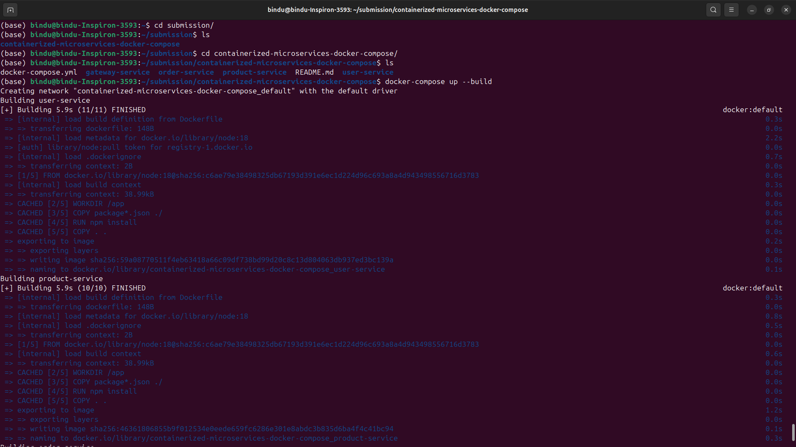
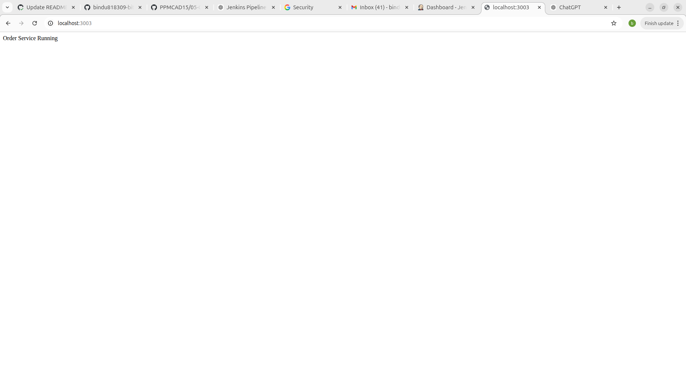

# 🚀 Microservices Containerization using Docker & Docker Compose

## 📌 Task Overview

This project demonstrates the containerization of a **Node.js-based microservices architecture** using Docker and Docker Compose.

The application consists of three core services:

* **Gateway Service** (Port 3000)
* **User Service** (Port 3001)
* **Product Service** (Port 3002)
* **Order Service** (Port 3003)

Each service is containerized independently and orchestrated using Docker Compose.

---

## 🛠️ Technologies Used

* Node.js
* Express.js
* Docker
* Docker Compose

---

## 📁 Project Structure

```id="t0m1m8"
submission/
├── user-service/
│   └── Dockerfile
├── product-service/
│   └── Dockerfile
├── gateway-service/
│   └── Dockerfile
├── docker-compose.yml
└── README.md
```

---

## 🐳 Dockerfile Configuration

Each service includes a Dockerfile that:

* Uses an official Node.js base image
* Sets a working directory
* Installs dependencies using npm
* Copies application source code
* Exposes the required port
* Defines a startup command using CMD

---

## ⚙️ Docker Compose Setup

The `docker-compose.yml` file:

* Defines all three services
* Maps container ports to host ports
* Uses a shared Docker network for communication

---

## 🚀 Setup Instructions

### 1. Clone the repository

```bash id="o7m9vp"
git clone https://github.com/<your-username>/containerized-microservices-docker-compose.git
cd containerized-microservices-docker-compose
```

---

### 2. Build and run the application

```bash id="vgb8m2"
docker-compose up --build -d
```

---

## 🌐 Access the Services

| Service         | URL                   |
| --------------- | --------------------- |
| Gateway Service | http://localhost:3000 |
| User Service    | http://localhost:3001 |
| Product Service | http://localhost:3002 |
| Order Service   | http://localhost:3003 |


---

## 🧪 Testing & Validation

### ✅ Verify containers are running

```bash id="qmw9f3"
docker-compose ps
```

### ✅ Test endpoints

Open the following in your browser:

* http://localhost:3000 → Gateway Service
* http://localhost:3001 → User Service
* http://localhost:3002 → Product Service
* http://localhost:3003 → Order Service

Each service should return a response confirming it is running.

---

## 📸 Screenshots

### Running Containers


## OrderService


## ProductService


## UserService


## gatewayService


## 🛑 Stop the Application

```bash id="rj4m21"
docker-compose down
```

---

## ⚠️ Troubleshooting

### Issue: Port already in use

Solution:

* Change port mapping in `docker-compose.yml`

---

### Issue: Container not starting

Solution:

```bash id="t2x8f6"
docker-compose logs
```

---

### Issue: Dependencies not installed

Solution:

```bash id="u4n3ka"
docker-compose up --build
```

---

## ✅ Evaluation Checklist

* ✔ Dockerfiles created for all services
* ✔ docker-compose.yml configured correctly
* ✔ Services run successfully using Docker Compose
* ✔ All services accessible via localhost
* ✔ Documentation provided with setup and testing steps

---

## 👨‍💻 Author

<your-name>
